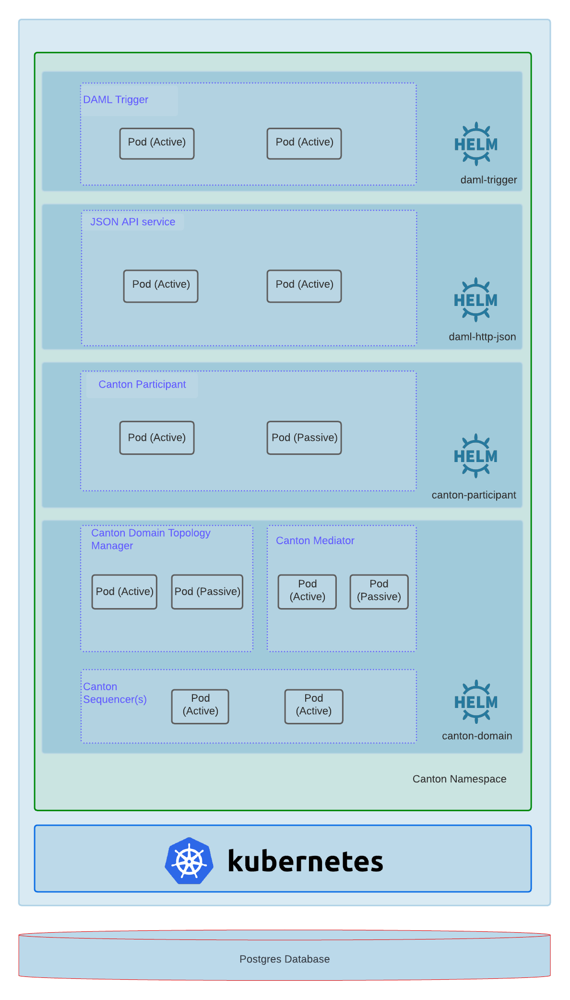

[](https://artifacthub.io/packages/search?repo=digital-asset)
[](./LICENSE)

# Daml Enterprise Helm charts

Daml Enterprise deployment with high availability, ready to install in Kubernetes using [Helm](https://github.com/helm/helm).

## Table of Contents

- [Introduction](#introduction)
- [TL;DR](#tldr)
- [Before you begin](#before-you-begin)
- [Installing Daml Helm charts](#installing-daml-helm-charts)
- [License](#license)

## Introduction

The following document intends to explain how to install the solution on a Kubernetes cluster. The Helm charts
available in this repository will install the following services:



⚠️ Please note that we are sharing the same PostgreSQL server/instance but each component has its own database.

## TL;DR

```bash
helm repo add digitalasset https://digital-asset.github.io/daml-helm-charts/
helm search repo digitalasset
helm install myrelease digitalasset/<chart>
```

## Before you begin

### Prerequisites

- Kubernetes `1.24+`
- Helm `3.9+`
- PostgreSQL server
- [Cert-manager](https://cert-manager.io/docs/) + CSI driver (only if TLS is enabled, optional but strongly recommended)

### [PostgreSQL guidelines](./POSTGRES.md)

### The purpose of Helm

Helm is a powerful tool for managing Kubernetes packages called charts, they contain Kubernetes resource templates with a
default configuration options. You can override any of these default settings with a YAML formatted
`values` file that you pass during installation.

Helm can do the following:

* Create new charts from scratch.
* Package charts into chart archive (`tgz`) files.
* Interact with chart repositories where charts are stored.
* Install and uninstall charts into an existing Kubernetes cluster.
* Manage the release cycle of charts that have been installed with Helm.

For Helm, there are three important concepts:

* The `chart` is a bundle of information necessary to create an instance of a Kubernetes application.
* The `config` contains configuration information that can be merged into a packaged chart to create a releasable object.
* A `release` is a running instance of a chart, combined with a specific `config`.

### Install Helm

Please refer to the [Installing Helm Guide](https://helm.sh/docs/intro/install/).

### Using Helm

Once you have installed the Helm client, you can deploy a Daml Enterprise Helm Chart into a Kubernetes cluster.

Please refer to the [Quickstart Guide](https://helm.sh/docs/intro/quickstart/) if you wish to get running
in just a few commands, otherwise the [Using Helm Guide](https://helm.sh/docs/intro/using_helm/) provides
detailed instructions on how to use the Helm client to manage packages on your Kubernetes cluster.

## Installing Helm charts

Please refer to the README of each Helm chart for detailed instructions on how to install/configure them.

For further information refer to the [Daml documentation](https://docs.daml.com/).

## [Contributing guidelines](./CONTRIBUTING.md)

## License

Copyright &copy; 2023 Digital Asset (Switzerland) GmbH and/or its affiliates

Licensed under the Apache License, Version 2.0 (the "License");
you may not use this file except in compliance with the License.
You may obtain a copy of the License at

http://www.apache.org/licenses/LICENSE-2.0

Unless required by applicable law or agreed to in writing, software
distributed under the License is distributed on an "AS IS" BASIS,
WITHOUT WARRANTIES OR CONDITIONS OF ANY KIND, either express or implied.
See the License for the specific language governing permissions and
limitations under the License.
