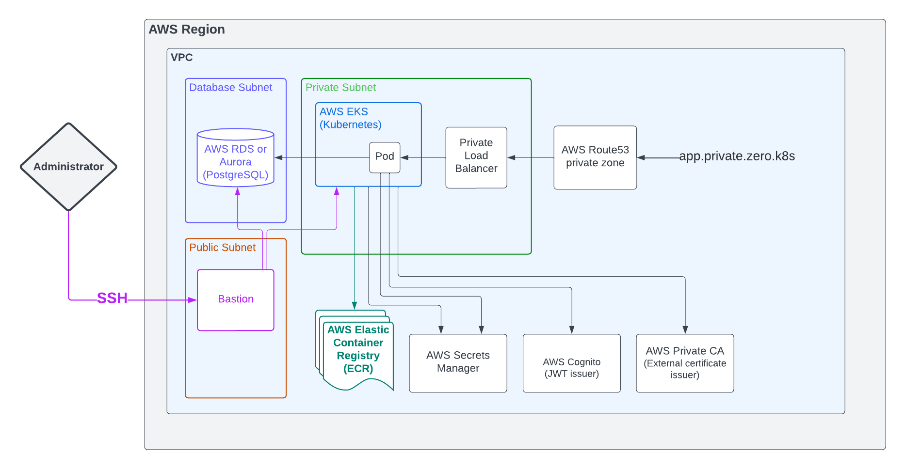
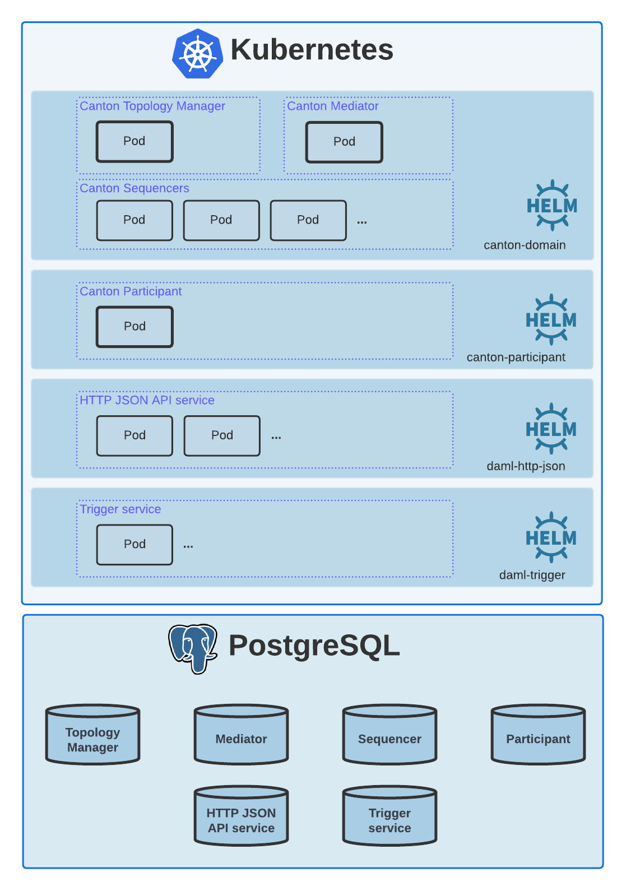

# Deploy on Kubernetes


## Audience

This content targets individuals with the following skills and experience:


* Basic hands-on experience with deploying and managing applications running on [Kubernetes](https://kubernetes.io/).
* Deploying applications packaged as [Helm charts](https://helm.sh/).
* Strong understanding of operational concepts of the chosen cloud provider, particularly monitoring and observability.
* Basic know-how of deployment and configuration of the chosen cloud provider’s components to adhere to tight security requirements. This includes setting up an IDP provider (Auth0, Azure AD, and so on), and a certificate issuer (such as GCP CA Service, AWS Private CA).


## Content covered

This section describes the objectives and target deployment for this guide.


### Objectives


* Describe the required cloud resources and how to configure them.
* Describe how to set up your Kubernetes cluster.
* Walk through the steps required for deploying all Daml Enterprise components on a Kubernetes cluster using Helm, Helmfile, or Argo CD.
* Provide automation to provision cloud resources through [Terraform code](https://www.terraform.io/).


### Target deployment

This document targets the following Daml Enterprise deployment on a Kubernetes cluster.

> **Note:** The goal is a highly available, production-ready deployment. Such a deployment may have associated costs, depending on your cloud provider. If you need a solution for local development only, follow the [Getting Started with Daml](https://docs.daml.com/getting-started/index.html) guide instead.


For an overview of the Daml Enterprise architecture, see [Introduction to Canton](https://docs.daml.com/canton/about.html).


* [Canton domain](https://docs.daml.com/canton/architecture/overview.html#domain-entities): These services make up the _domain entities_ of a Daml Enterprise deployment. Except for the _sequencers_, all achieve high availability via active-passive clustering.
* [Canton participant](https://docs.daml.com/concepts/glossary.html#participant-node): This service provides access to the Daml Ledger for Daml applications. You can achieve high availability through active-passive clustering.
* [HTTP JSON API service](https://docs.daml.com/json-api/index.html): This service exposes a JSON API for interacting with a _participant_, allowing application writers to use a simpler version of the [Ledger API](https://docs.daml.com/app-dev/ledger-api.html). You can achieve high availability through active-active clustering.

To learn more about how high availability is achieved for Daml Enterprise on Kubernetes, see section High Availability On Kubernetes. You can find all of the Helm charts referenced by the target deployment architecture in the [Daml Enterprise Helm charts repository](https://github.com/digital-asset/daml-helm-charts/tree/main).


## Prerequisites

For detailed prerequisites, see these sections:


1. Provision cloud resources
2. Deploy dependencies
3. Deploy Daml Enterprise

> **Note:** This guide assumes you are running on Linux or macOS.


# Provision cloud resources with Terraform


> **Note:** If you plan to use GitOps via Argo CD to deploy Daml Enterprise to Kubernetes, you must fork the [Daml Enterprise Deployment Resources](https://github.com/DACH-NY/daml-enterprise-deployment-blueprints). If you plan to follow other options like Helm or Helmfile (recommended), you can directly clone the [Daml Enterprise Deployment Resources](https://github.com/DACH-NY/daml-enterprise-deployment-blueprints/).


> **Note:** All the resources created are private. Nothing is exposed over the public Internet.


## Objectives

This section covers the following objectives:


1. Configure access to your cloud account and [configure Terraform](https://www.terraform.io/).
2. Create resources in your Azure subscription required for deploying Daml Enterprise.
3. Initialize databases and configure Kubernetes secrets.
4. Copy Daml Enterprise container images into a private container registry.

The following diagram provides an overview of the target state for the Terraform configuration. For details, consult the [Terraform configuration files](https://github.com/DACH-NY/daml-enterprise-deployment-blueprints/tree/main/azure/terraform) and the default IPv4 addressing plan.

**Azure**


**AWS**




## Prerequisites


1. Credentials to access the [Digital Asset Artifactory](https://digitalasset.jfrog.io/) and pull Daml Enterprise container images
2. GitHub account with access to the [Daml Enterprise Deployment Resources](https://github.com/DACH-NY/daml-enterprise-deployment-blueprints/)
3. [jq](https://jqlang.github.io/jq/download/) [`1.5+`]
4. CLI client for your cloud provider of choice:
    1. [Azure CLI](https://learn.microsoft.com/en-us/cli/azure/install-azure-cli) [latest]
    2. [AWS CLI](https://aws.amazon.com/cli/) [latest]
5. [Terraform](https://developer.hashicorp.com/terraform/downloads) [`1.4+`]
6. [regctl](https://github.com/regclient/regclient/blob/main/docs/install.md) [`0.4+`]
7. [PostgreSQL interactive terminal](https://www.postgresql.org/download/) [`14+`]
8. [Kubernetes command-line tool](https://kubernetes.io/docs/tasks/tools/) [`1.25+`]
9. [Helm](https://helm.sh/docs/intro/install/) [`3.9+`]
10. [Helmfile (optional)](https://helmfile.readthedocs.io/) [`0.150+`]


## Steps

> **Note:** The following steps assume that you have cloned [Daml Enterprise Deployment Resources](https://github.com/DACH-NY/daml-enterprise-deployment-blueprints/), and that your working directory is `azure/terraform` or `aws/terraform`, depending on your cloud provider of choice.


### Create SSH key to access bastion

You must provide an existing SSH key pair to access the proxy (also called bastion) to be created. You can create a new one using this command:


```
ssh-keygen -m PEM -t rsa -b 4096 -f /path/to/ssh/key -C 'bastion@zero.k8s'
```
> **Note:** For increased security, provide a passphrase for the created SSH key.


### Set up your cloud account

**Azure**AWS
**TK ADD AWS**

Log in to Azure and select the target subscription (if you have multiple ones):


```
az login
az account list
az account set --subscription <subscription_id>
```


### Configure Terraform

**Azure**AWS
**TK ADD AWS**

To configure Terraform for your Azure subscription, follow these steps:


* Provide an existing Azure resource group. You can create a new one with this command: \
`az group create --name &lt;resource_group_name> --location &lt;location>`
* Create your own backend configuration
* Copy and customize the variables file [sample.tfvars](https://github.com/DACH-NY/daml-enterprise-deployment-blueprints/blob/main/azure/terraform/sample.tfvars). Use the resource group you just created. You can use the file name `terraform.tfvars` to avoid passing the argument `--var-file=/path/to/file.tfvars` on each run.

> **Note:** There are multiple ways to [configure the backend](https://developer.hashicorp.com/terraform/language/settings/backends/configuration) and manage different environments (development, staging, production, and so on) within the same repository. Select the appropriate solution for your needs. For local testing, use the [Terraform default backend](https://developer.hashicorp.com/terraform/language/settings/backends/configuration#default-backend).


To learn more about Terraform, consult the [Terraform documentation](https://developer.hashicorp.com/terraform/tutorials).


### Initialize Terraform and preview the execution plan

To initialize Terraform and the directory containing Terraform configuration files, run this command:


```
terraform init
terraform plan
```


The last command displays the Terraform execution plan, which indicates the changes that Terraform intends to make to your cloud subscription.


### Apply changes proposed in the execution plan

To apply the proposed changes in the execution plan, use this command:


```
terraform apply
```

> **Note:** It initially takes 15 to 20 minutes to create a Kubernetes cluster.


### Access to Kubernetes API

There are different ways to configure access to the Kubernetes API using the CLI. Choose one option and proceed.


#### a) Using a kubectl configuration context (recommended)

Open a new terminal to make an SSH tunnel (available on `localhost:44443`): \
`make kubectl-proxy`


1. Merge and switch to the new `kubectl` configuration (also called `kubeconfig`) to your Kubernetes cluster using the SSH tunnel: \
`./bootstraps/merge-kubeconfig.sh`

2. Run commands such as `kubectl`, `helm`, and `helmfile` as usual.


#### b) Target the kubectl configuration file

Open a new terminal to make an SSH tunnel (available on `localhost:44443`): \
`make kubectl-proxy`

1. Set the Kubernetes CLI configuration file (this is lost if you use a new or different terminal): \
<code>export KUBECONFIG="<strong>$(</strong>pwd<strong>)</strong>/outputs/kube/ssh.config"</code>

2. Run commands such as `kubectl`, `helm`, and `helmfile`as usual.


### Access to PostgreSQL

To enable access to the provisioned PostgreSQL server:

1. Open a new terminal to make an SSH tunnel (available on `localhost:5432`) \
`make psql-proxy`

2. Connect to the PostgreSQL server using admin credentials: \
`make psql`


### Set up PostgreSQL & Kubernetes secrets

Complete the PostgreSQL server setup that is required for deploying Daml Enterprise components, creating roles/database, storing passwords into Key Vault, and creating Kubernetes secrets:


```
./bootstraps/postgresql.sh
```


### Copy container images to private container registry

Set environment variables to access the Digital Asset container image registry at `digitalasset-docker.jfrog.io`:


```
export ARTIFACTORY_USER='<your_user>'
export ARTIFACTORY_API_KEY='<your_api_key>'
```


Copy container images from the Digital Asset Artifactory to the private container registry:


```
./bootstraps/clone-images.sh 2.7.1
```


## Next steps

At this point, all cloud resources should be provisioned and set up. Continue with the Deploy dependencies section.


## Deployment details


### Interact with the deployment

<!-- To interact with the deployment, use the `Makefile` under `azure/terraform` or `aws/terraform`. To list all the supported commands, invoke `make help` or `make`. -->


### Access to bastion/proxy

Connect to the bastion VM provisioned using SSH:


```
make bastion
```

> **Note:** Only the public IP of the machine used to run Terraform can connect by default. You can provide a static array of public IPs with the Terraform variable `admin_public_ips`.


### Default private IPv4 addressing plan

**Azure**AWS
**TK ADD AWS**

<table>
  <tr>
   <td>
<strong>NAME</strong>
   </td>
   <td>
<strong>CIDR</strong>
   </td>
   <td>
<strong>START</strong>
   </td>
   <td>
<strong>END</strong>
   </td>
   <td>
<strong>AVAILABLE IPS</strong>
   </td>
  </tr>
  <tr>
   <td>
Virtual network
   </td>
   <td>
<code>10.0.0.0/16</code>
   </td>
   <td>
<code>10.0.0.0</code>
   </td>
   <td>
<code>10.0.255.255</code>
   </td>
   <td>
<code>65536</code>
   </td>
  </tr>
  <tr>
   <td>
Public subnet
   </td>
   <td>
<code>10.0.0.0/19</code>
   </td>
   <td>
<code>10.0.0.0</code>
   </td>
   <td>
<code>10.0.31.255</code>
   </td>
   <td>
<code>8192</code>
   </td>
  </tr>
  <tr>
   <td>
Private subnet
   </td>
   <td>
<code>10.0.32.0/19</code>
   </td>
   <td>
<code>10.0.32.0</code>
   </td>
   <td>
<code>10.0.63.255</code>
   </td>
   <td>
<code>8191</code>
   </td>
  </tr>
  <tr>
   <td>
AKS internal load balancer
   </td>
   <td>
<code>10.0.63.1/32</code>
   </td>
   <td>
<code>10.0.63.1</code>
   </td>
   <td>
<code>10.0.63.1</code>
   </td>
   <td>
<code>1</code>
   </td>
  </tr>
  <tr>
   <td>
AKS pods
   </td>
   <td>
<code>10.0.64.0/19</code>
   </td>
   <td>
<code>10.0.64.0</code>
   </td>
   <td>
<code>10.0.95.255</code>
   </td>
   <td>
<code>8192</code>
   </td>
  </tr>
  <tr>
   <td>
AKS services
   </td>
   <td>
<code>10.0.96.0/22</code>
   </td>
   <td>
<code>10.0.96.0</code>
   </td>
   <td>
<code>10.0.99.255</code>
   </td>
   <td>
<code>1024</code>
   </td>
  </tr>
  <tr>
   <td>
AKS ingresses
   </td>
   <td>
<code>10.0.100.0/22</code>
   </td>
   <td>
<code>10.0.100.0</code>
   </td>
   <td>
<code>10.0.103.255</code>
   </td>
   <td>
<code>1024</code>
   </td>
  </tr>
  <tr>
   <td>
Database subnet
   </td>
   <td>
<code>10.0.104.0/24</code>
   </td>
   <td>
<code>10.0.104.0</code>
   </td>
   <td>
<code>10.0.104.255</code>
   </td>
   <td>
<code>256</code>
   </td>
  </tr>
  <tr>
   <td>
Space (1)
   </td>
   <td>
<code>10.0.105.0/17</code>
   </td>
   <td>
<code>10.0.105.0</code>
   </td>
   <td>
<code>10.0.127.255</code>
   </td>
   <td>
<code>5888</code>
   </td>
  </tr>
  <tr>
   <td>
Space (2)
   </td>
   <td>
<code>10.0.128.0/17</code>
   </td>
   <td>
<code>10.0.128.0</code>
   </td>
   <td>
<code>10.0.255.255</code>
   </td>
   <td>
<code>32768</code>
   </td>
  </tr>
</table>


# Deploy dependencies

If you are using Helmfile to deploy, you can skip the following steps.


## Objectives

This section covers deploying the components onto a Kubernetes cluster that are needed to run Daml Enterprise:


* Set up certificate management for your cluster.
* Ensure caching of container images for faster Pod startups on all Kubernetes nodes (optional).


## Prerequisites


* A running Kubernetes cluster (1.24+) in which you have access to the following:
    * Create and manage namespaces
    * Manage resources, including Custom Resource Definitions
* The following command-line tools installed:
    * [kubectl](https://kubernetes.io/docs/tasks/tools/#kubectl)
    * [Helm](https://helm.sh/docs/intro/install/)


## Next steps


1. Complete the Deploy cert-manager and Create certificate issuers sections.
2. Then continue with the Deploy Daml Enterprise section.


# Deploy cert-manager


## Objectives


1. Prepare your Kubernetes environment for installing cert-manager.
2. Install cert-manager components using Helm.


## Introduction

This guide installs [cert-manager](https://cert-manager.io/docs/) on a Kubernetes cluster. It is a Kubernetes add-on to help manage certificates. Canton uses the add-on to generate and renew certificates for the various components.


## Prerequisites


* Kubernetes 1.24+
* [Helm](https://helm.sh/docs/intro/install/) and [kubectl](https://kubernetes.io/docs/tasks/tools/#kubectl) installed locally
* Access to the Kubernetes cluster with the necessary permissions to install Kubernetes resources, including Custom Resource Definitions and namespaces


## Install cert-manager with Helm


### Add the Jetstack Helm repository

For access to the cert-manager Helm charts, add the `jetstack.io` Helm chart repository to your Helm client environment and update your local cache:


```
helm repo add jetstack https://charts.jetstack.io
```


Inspect the available Helm charts in the Jetstack Helm repository:


```
helm search repo jetstack
```


> **Note:** Jetstack is the only supported source of cert-manager charts. Other mirrors or copies are unofficial and could represent a security risk. For more information, see the [cert-manager documentation](https://cert-manager.io/docs/installation/helm/).


### Install Helm chart for cert-manager

Installing the Helm charts creates the Kubernetes resources required to run cert-manager and cert-manager-csi-driver.

Install the cert-manager Helm chart, including the Custom Resource Definitions (CRDs) into the cert-manager namespace:


```
helm -n cert-manager install cert-manager jetstack/cert-manager \
  --set installCRDs=true --create-namespace
```


### Install Helm Chart for cert-manager-csi-driver

The following command is required for cert-manager to expose Daml Enterprise services through the [Kubernetes Container Storage Interface](https://kubernetes-csi.github.io/docs/introduction.html):


```
helm -n cert-manager install cert-manager-csi-driver \
  jetstack/cert-manager-csi-driver
```


### Verify the installations

Verify that the cert-manager Pods are running with this command:


```
kubectl -n cert-manager get pods
```


Verify that the CSI driver has been installed by running this command:


```
helm list -aA
```


Alternatively, cert-manager Helm charts can be pulled using the `helm pull` command. This downloads the Helm charts to your local machine. You can then install the Helm charts using the `helm install` command after the value files are created.


# Create certificate issuers (Azure only)


> **Note:** If you are deploying on AWS, you may skip this section as the Terraform config provisions a certificate authority using [AWS Private CA](https://aws.amazon.com/private-ca/).


## Objectives


* Configure a [smallstep](https://smallstep.com/) cert-manager compatible certificate issuer.
* Deploy smallstep components to a Kubernetes cluster with Helm.
* Set TLS configuration when deploying Daml Enterprise components with Helm.

For more details on the cert-manager integration available for smallstep, see the [smallstep documentation](https://smallstep.com/docs/step-ca/integrations/#kubernetes).


## Prerequisites


* [Docker](https://www.docker.com/products/docker-desktop/)
* [Helm](https://helm.sh/docs/intro/install/) installed
* [jq](https://github.com/jqlang/jq)


## Configure smallstep

The Terraform deployment generates the scripts for the smallstep setup. The following commands assume the current directory is the `azure/terraform` folder in your clone of the [Daml Enterprise Deployment Resources](https://github.com/DACH-NY/daml-enterprise-deployment-blueprints/).


```
cd azure/terraform/
```


> **Note:** The following sections contain slightly different terminal commands for Linux and Mac. Select the one for your operating system. The sections show the contents of the generated files along with the example output for each.


### Generate `step-certificates` configuration


_Linux command_


```
  ./outputs/smallstep/linux_create_config.sh
```

The output should be similar to the following:

```
  $ cat ./outputs/smallstep/linux_create_config.sh
   docker run --rm \
     --user ${UID} \
     -v "/home/ubuntu/dev/daml-enterprise-k8s-deployment-guide/02-provision-cloud-resources/iac/outputs/smallstep/passwords":/home/step/passwords \
     -v "/home/ubuntu/dev/daml-enterprise-k8s-deployment-guide/02-provision-cloud-resources/iac/outputs/smallstep/config":/home/step/config \
     -v "/home/ubuntu/dev/daml-enterprise-k8s-deployment-guide/02-provision-cloud-resources/iac/outputs/smallstep/certs":/home/step/certs \
     -v "/home/ubuntu/dev/daml-enterprise-k8s-deployment-guide/02-provision-cloud-resources/iac/outputs/smallstep/secrets":/home/step/secrets \
     cr.step.sm/smallstep/step-ca-bootstrap:latest \
     step ca init \
     --name "smallstep-canton" \
     --dns "smallstep-canton-step-certificates.smallstep.svc.cluster.local" \
     --address ":9000" \
     --provisioner "canton-tls" \
     --with-ca-url "https://smallstep-canton-step-certificates.smallstep.svc.cluster.local" \
     --password-file "/home/step/passwords/ca.txt" \
     --provisioner-password-file "/home/step/passwords/provisioner.txt"

   $ ./outputs/smallstep/linux_create_config.sh

   Generating root certificate... done!
   Generating intermediate certificate... done!

   ✔ Root certificate: /home/step/certs/root_ca.crt
   ✔ Root private key: /home/step/secrets/root_ca_key
   ✔ Root fingerprint: 4f182ac049c29774b3ae95e6bb1976092f15ad1335ebccfe8f3d637dcc8e596b
   ✔ Intermediate certificate: /home/step/certs/intermediate_ca.crt
   ✔ Intermediate private key: /home/step/secrets/intermediate_ca_key
   ✔ Database folder: /home/step/db
   ✔ Default configuration: /home/step/config/defaults.json
   ✔ Certificate Authority configuration: /home/step/config/ca.json

   Your PKI is ready to go. To generate certificates for individual services see 'step help ca'.

   FEEDBACK 😍 🍻
     The step utility is not instrumented for usage statistics. It does not phone
     home. But your feedback is extremely valuable. Any information you can provide
     regarding how you're using `step` helps. Please send us a sentence or two,
     good or bad at feedback@smallstep.com or join GitHub Discussions
     https://github.com/smallstep/certificates/discussions and our Discord
     https://u.step.sm/discord.
```

*Mac command*

```
  ./outputs/smallstep/macos_create_config.sh
```


The output should be similar to the following:

```
$ cat ./outputs/smallstep/macos_create_config.sh
docker run --rm \
  -v "./passwords":/home/step/passwords \
  -v "./config":/home/step/config \
  -v "./certs":/home/step/certs \
  -v "./secrets":/home/step/secrets \
  cr.step.sm/smallstep/step-ca-bootstrap:latest \
  step ca init \
  --name "smallstep-canton" \
  --dns "smallstep-canton-step-certificates.smallstep.svc.cluster.local" \
  --address ":9000" \
  --provisioner "canton-tls" \
  --with-ca-url "https://smallstep-canton-step-certificates.smallstep.svc.cluster.local" \
  --password-file "/home/step/passwords/ca.txt" \
  --provisioner-password-file "/home/step/passwords/provisioner.txt"

$ ./outputs/smallstep/macos_create_config.sh

Generating root certificate... done!
Generating intermediate certificate... done!

✔ Root certificate: /home/step/certs/root_ca.crt
✔ Root private key: /home/step/secrets/root_ca_key
✔ Root fingerprint: 4f182ac049c29774b3ae95e6bb1976092f15ad1335ebccfe8f3d637dcc8e596b
✔ Intermediate certificate: /home/step/certs/intermediate_ca.crt
✔ Intermediate private key: /home/step/secrets/intermediate_ca_key
✔ Database folder: /home/step/db
✔ Default configuration: /home/step/config/defaults.json
✔ Certificate Authority configuration: /home/step/config/ca.json

Your PKI is ready to go. To generate certificates for individual services see 'step help ca'.

FEEDBACK 😍 🍻
  The step utility is not instrumented for usage statistics. It does not phone
  home. But your feedback is extremely valuable. Any information you can provide
  regarding how you're using `step` helps. Please send us a sentence or two,
  good or bad at feedback@smallstep.com or join GitHub Discussions
  https://github.com/smallstep/certificates/discussions and our Discord
  https://u.step.sm/discord.
```


### Increase maximum generated certificate duration

Certificates can only be rotated by a full restart for Daml Enterprise, so set the maximum generated certificate duration to 10 years:


_Linux command_


```
  ./outputs/smallstep/linux_certificate_duration.sh
```

The output should be similar to the following:

```
$ cat ./outputs/smallstep/linux_certificate_duration.sh
docker run --rm \
   --user ${UID} \
   -v "/home/ubuntu/dev/daml-enterprise-k8s-deployment-guide/02-provision-cloud-resources/iac/outputs/smallstep/config":/home/step/config \
   cr.step.sm/smallstep/step-ca-bootstrap:latest \
   step ca provisioner \
      update canton-tls \
      --x509-max-dur=88000h

$ ./outputs/smallstep/linux_certificate_duration.sh
✔ CA Configuration: /home/step/config/ca.json

Success! Your `step-ca` config has been updated. To pick up the new configuration SIGHUP (kill -1 <pid>) or restart the step-ca process.
```

*Mac command*

```
  ./outputs/smallstep/macos_certificate_duration.sh
```

The output should be similar to the following:

```
$ cat ./outputs/smallstep/macos_certificate_duration.sh
docker run --rm \
  -v "./config":/home/step/config \
  cr.step.sm/smallstep/step-ca-bootstrap:latest \
  step ca provisioner \
    update canton-tls \
    --x509-max-dur=88000h

$ ./outputs/smallstep/macos_certificate_duration.sh
✔ CA Configuration: /home/step/config/ca.json

Success! Your `step-ca` config has been updated. To pick up the new configuration SIGHUP (kill -1 <pid>) or restart the step-ca process.
```


### Configure Kubernetes cluster

Add the configurations and secrets to the Kubernetes cluster with the following command:


```
./outputs/smallstep/create_secrets.sh
```


The output should be similar to the following:


```
$ cat ./outputs/smallstep/create_secrets.sh
kubectl create namespace "smallstep"

kubectl -n "smallstep" \
  create configmap "smallstep-canton-step-certificates-config" \
  --from-file "./outputs/smallstep/config"

kubectl -n "smallstep" \
  create configmap "smallstep-canton-step-certificates-certs" \
  --from-file "./outputs/smallstep/certs"

kubectl -n "smallstep" \
  create secret generic "smallstep-canton-step-certificates-secrets" \
  --from-file "./outputs/smallstep/secrets/intermediate_ca_key"

kubectl -n "smallstep" \
  create secret generic "smallstep-canton-step-certificates-ca-password" \
  --from-file "password=./outputs/smallstep/passwords/ca.txt"

kubectl -n "smallstep" \
  create secret generic "smallstep-canton-step-certificates-provisioner-password"\
  --from-file "password=./outputs/smallstep/passwords/provisioner.txt"

$ ./outputs/smallstep/create_secrets.sh
namespace/smallstep created
configmap/smallstep-canton-step-certificates-config created
configmap/smallstep-canton-step-certificates-certs created
secret/smallstep-canton-step-certificates-secrets created
secret/smallstep-canton-step-certificates-ca-password created
secret/smallstep-canton-step-certificates-provisioner-password created
```


## Deploy smallstep cert-manager issuer


### Set up Helm repository for smallstep

To be able to pull the official smallstep Helm charts, add the smallstep repository:


```
helm repo add smallstep https://smallstep.github.io/helm-charts
```


You should then see:


```
"smallstep" has been added to your repositories
```


### Deploy `step-certificates` with Helm

Configure the chart using `outputs/smallstep/step_certificates_values.yaml`:


```
$ cat ./outputs/smallstep/step_certificates_values.yaml
existingSecrets:
  enabled: true
  ca: true

bootstrap:
  secrets: false
  enabled: false
  configmaps: false

inject:
  enabled: false
```


Install `step-certificates` with this command:


```
./outputs/smallstep/helm_install_step_certificate.sh
```


The output should be similar to the following:


```
$ cat ./outputs/smallstep/helm_install_step_certificate.sh
helm -n smallstep install \
  smallstep-canton smallstep/step-certificates \
  --version 1.23.2+5 \
  -f step_certificates_values.yaml \
  --wait-for-jobs --wait

$ ./outputs/smallstep/helm_install_step_certificate.sh
NAME: smallstep-canton
LAST DEPLOYED: Mon Jul 31 08:49:16 2023
NAMESPACE: smallstep
STATUS: deployed
REVISION: 1
NOTES:
Thanks for installing Step CA.

1. Get the PKI and Provisioner secrets running these commands:
  kubectl get -n smallstep -o jsonpath='{.data.password}' secret/smallstep-canton-step-certificates-ca-password | base64 --decode
  kubectl get -n smallstep -o jsonpath='{.data.password}' secret/smallstep-canton-step-certificates-provisioner-password | base64 --decode
```


### Deploy `step-issuer` with Helm

To install `step-issuer`, execute this command:


```
./outputs/smallstep/helm_install_step_issuer.sh
```


Use the default configuration:


```
$ cat ./outputs/smallstep/helm_install_step_issuer.sh
helm -n smallstep install \
  smallstep-canton-issuer smallstep/step-issuer \
  --version 0.7.0 \
  --wait-for-jobs --wait

$ ./outputs/smallstep/helm_install_step_issuer.sh
NAME: smallstep-canton-issuer
LAST DEPLOYED: Mon Jul 31 08:52:06 2023
NAMESPACE: smallstep
STATUS: deployed
REVISION: 1
TEST SUITE: None
NOTES:
⚙️  Thanks for installing step-issuer.

step-issuer is ideal for issuing certificates
from your own private Certificate Authority (CA).

To start issuing certificates, you will need:

👉 A cert-manager installation
👉 A step-ca Certificate Authority (CA) or a smallstep Certificate Manager authority
👉 A StepIssuer resource that links step-issuer to your CA

To continue, follow the instructions here:

https://u.step.sm/step-issuer
```


## Create certificate issuers


### Create the Kubernetes resource description


```
  ./outputs/smallstep/create_step_cluster_issuer_config.sh
```

The output should be similar to the following:

```
$ cat ./outputs/smallstep/create_step_cluster_issuer_config.sh
cat > canton-tls-issuer.yaml <<EOF
apiVersion: certmanager.step.sm/v1beta1
kind: StepClusterIssuer
metadata:
  name: canton-tls-issuer
  namespace: smallstep
spec:
  # The CA URL:
  url: https://smallstep-canton-step-certificates.smallstep.svc.cluster.local
  # The base64 encoded version of the CA root certificate in PEM format:
  caBundle: $(base64 -i "./certs/root_ca.crt" | tr -d '\n')
  # The provisioner name, kid, and a reference to the provisioner password secret:
  provisioner:
    name: canton-tls
    kid: $(jq ".authority.provisioners[0].key.kid" "./config/ca.json")
    passwordRef:
      namespace: smallstep
      name: smallstep-canton-step-certificates-provisioner-password
      key: password
EOF

$ ./outputs/smallstep/create_step_cluster_issuer_config.sh
```


### Deploy the certificate issuer


```
  ./outputs/smallstep/create_step_cluster_issuer.sh
```

The output should be similar to the following:

```
$ cat ./outputs/smallstep/create_step_cluster_issuer.sh
kubectl apply -f ./canton-tls-issuer.yaml

$ ./outputs/smallstep/create_step_cluster_issuer.sh
stepclusterissuer.certmanager.step.sm/canton-tls-issuer configured
```


### Check that the certificate issuer is ready


```
  ./outputs/smallstep/check_step_cluster_issuer.sh
```

The output should be similar to the following:

```
$ cat ./outputs/smallstep/check_step_cluster_issuer.sh
kubectl get -n smallstep StepClusterIssuer canton-tls-issuer -o yaml

$ ./outputs/smallstep/check_step_cluster_issuer.sh
apiVersion: certmanager.step.sm/v1beta1
kind: StepClusterIssuer
[...]
status:
  conditions:
  - lastTransitionTime: "2023-07-31T08:57:17Z"
    message: StepClusterIssuer verified and ready to sign certificates
    reason: Verified
    status: "True"
    type: Ready
```


To troubleshoot problems with certificate issuance, see the [cert-manager documentation](https://cert-manager.io/docs/troubleshooting/).


## Secure smallstep certificate issuer

Smallstep provides complete [documentation about production configuration](https://smallstep.com/docs/step-ca/certificate-authority-server-production/). For this deployment, the important points are the following:


* Securing the root CA private key
* Securing the passwords


# Deploy the Traefik Ingress controller


## Objectives


* Deploy and set up the [Traefik Ingress controller](https://github.com/traefik/traefik-helm-chart).


## Introduction

Traefik is a simple and powerful reverse proxy that can be used as a [Kubernetes Ingress controller](https://kubernetes.io/docs/concepts/services-networking/ingress-controllers/). It can route traffic to a wide variety of infrastructure components and manage its configuration automatically. The following steps install Traefik into your Kubernetes cluster.


## Installation guide


1. Add the Traefik Helm repository: \
<code>helm repo add traefik [https://traefik.github.io/charts](https://traefik.github.io/charts)</code>
2. Confirm Helm chart availability:

After the previous step, you should be able to search the repo for the Traefik chart:


```
helm search repo traefik
```


Expected output:


```
NAME                    CHART VERSION   APP VERSION     DESCRIPTION
traefik/traefik         23.2.0          v2.10.4         A Traefik based Kubernetes ingress controller
traefik/traefik-hub     1.0.6           v2.1.0          Traefik Hub Ingress Controller
traefik/traefik-mesh    4.1.1           v1.4.8          Traefik Mesh - Simpler Service Mesh
traefik/traefikee       1.14.1          v2.10.2         Traefik Enterprise is a unified cloud-native ne...
traefik/hub-agent       1.6.0           v1.4.2          Traefik Hub is an all-in-one global networking ...
traefik/maesh           2.1.2           v1.3.2          Maesh - Simpler Service Mesh

```


1. Install Traefik. The following command expects that you are in the root directory of your clone of the [Daml Enterprise Deployment Resources](https://github.com/DACH-NY/daml-enterprise-deployment-blueprints/):

**Azure**


```
helm -n traefik install traefik traefik/traefik --set disableValidation=true -f azure/helm/values/traefik.yaml --create-namespace
```


AWS


```
helm -n traefik install traefik traefik/traefik --set disableValidation=true -f aws/helm/values/traefik.yaml --create-namespac
```


Expected output:


```
NAME: traefik
LAST DEPLOYED: Wed Aug  2 11:08:59 2023
NAMESPACE: traefik
STATUS: deployed
REVISION: 1
TEST SUITE: None
NOTES:
Traefik Proxy v2.10.4 has been deployed successfully on traefik namespace !
```


Verify the Traefik Pod’s availability:


```
kubectl -n traefik get pods
```


Expected output:


```
NAME                      READY   STATUS    RESTARTS   AGE
traefik-894c9975c-z6mst   1/1     Running   0          15m
```


# Configure Kubernetes Image Puller (optional)


## Objectives


1. Deploy and set up the [Kubernetes Image Puller utility](https://github.com/che-incubator/kubernetes-image-puller).


## Introduction

This is a simple implementation of the [Kubernetes Image Puller](https://github.com/che-incubator/kubernetes-image-puller). The purpose is to pre-cache the images across all nodes of a Kubernetes cluster, making failover and Pod recreation faster. This is an optional step. If a Pod is placed on a node which does not have its image yet, it pulls it from the designated repository according to standard behavior.


## Installation guide


1. Pull the image puller Helm chart: \
`git clone git@github.com:che-incubator/kubernetes-image-puller.git`
2. The Helm chart is located in the `deploy/helm` directory.

Parameterize the value file of the Kubernetes image puller Helm chart. Here is an example of a value file for the Kubernetes image puller Helm chart (see the [kubernetes-image-puller documentation](https://github.com/che-incubator/kubernetes-image-puller#configuration---helm) for all options):


```
deploymentName: kubernetes-image-puller
image:
 repository: quay.io/eclipse/kubernetes-image-puller
 tag: next
serviceAccount:
 name: kubernetes-image-puller
configMap:
 name: kubernetes-image-puller
 images: >-
   <image>=<repository>/<image>:<tag>;
   <image>=<repository>/<image>:<tag>;
 cachingIntervalHours: 1
 cachingMemoryRequest: "10Mi"
 cachingMemoryLimit: "20Mi"
 cachingCpuRequest: ".05"
 cachingCpuLimit: ".2"
 nodeSelector: "{}"
 affinity: "{}"
```


The image puller pulls its default image from `quay.io`. You can change this by setting the following values: 

<code>image</code>:


```
 repository: quay.io/eclipse/kubernetes-image-puller
 tag: next
```


Configure which images are cached by the image puller in the `configMap.images` list. The format of the list follows: 

<code>configMap</code>:


```
 images: >
   <image>=<repository>/<image>:<tag>;
```


Fill this list with the images you want to be cached by the image puller. This depends on the version of Daml Enterprise you would like to deploy to the Kubernetes cluster. For example, to deploy Daml Enterprise 2.6.4, add the following images to the list: 

<code>configMap</code>:


```
 images: >
   canton-enterprise=<acr_hostname>/digitalasset/canton-enterprise:2.7.1;
   canton-enterprise-debug=<acr_hostname>/digitalasset/canton-enterprise:2.7.1-debug;
   http-json=<acr_hostname>/http-json:2.7.1;

```


3. Install the Helm chart by running the following command from the root directory of the repository: \
`helm -n kubernetes-image-puller install kubernetes-image-puller --create-namespace deploy/helm`


# Deploy Daml Enterprise

Daml Enterprise is a set of components required to run Daml applications in production (see the Deploy on Kubernetes section).

There are many ways to create and manage Kubernetes objects. This section focuses on deploying Daml Enterprise to Kubernetes using popular tools. Choose one option and proceed.


* Using Helm
* Using Helmfile (recommended)
* Using Argo CD

If you deploy components independently, follow this sequence:


1. Canton participant
2. Canton domain (bootstraps both the domain itself and its participant)
3. Daml HTTP JSON API service (requires a functional Ledger API)

> **Note:** The following sections assume that the working directory is the root of your clone of the [Daml Enterprise Deployment Resources](https://github.com/DACH-NY/daml-enterprise-deployment-blueprints/tree/main/), unless stated otherwise. Be sure that you completed the previous steps successfully.


#  Helm Deployment of Daml Enterprise


## Objectives

* Set up access to Daml Enterprise Helm charts
* Prepare the Kubernetes environment
* Install the Daml Enterprise components with Helm

##  Prerequisites

* CLI tools:
    * [Kubernetes command-line tool](https://kubernetes.io/docs/tasks/tools/) [`1.25+`]
    * [Helm installed](https://helm.sh/docs/intro/install/) [`3.9+`]
* Access to your Kubernetes cluster via `kubectl`

##  Introduction


This section walks through the steps to install Daml Enterprise on a Kubernetes cluster using [Helm](https://helm.sh/), a package manager for Kubernetes. Helm charts define a set of Kubernetes resources that may be deployed together.


> **Note:** For more information on Helm, refer to the [Helm Quickstart Guide](https://helm.sh/docs/intro/quickstart/).


##  Steps


### Add the Digital Asset Helm chart repository

Add the Digital Asset Helm chart repository to your local Helm cache:


```
        helm repo add digital-asset https://digital-asset.github.io/daml-helm-charts/
        helm search repo digital-asset
```


Inspect the available Helm charts in the Digital Asset Helm repository:


```
        helm search repo digital-asset
```


Expected output:


```
        NAME                            CHART VERSION   APP VERSION     DESCRIPTION
        digital-asset/canton-domain      0.4.0           2.7.1           A Helm chart for Canton Domains
        digital-asset/canton-participant 0.4.0           2.7.1           A Helm chart for Canton Participants
        digital-asset/daml-http-json     0.4.0           2.7.1           A Helm chart for Daml HTTP JSON API service
        digital-asset/daml-trigger       0.4.0           2.7.1           A Helm chart for Daml Trigger service
```


# Install `canton-participant` chart


##  Objectives


* Customize the Helm chart parameters
* Install the Helm chart
* Verify the deployment status

## Steps


### 1. Inspect the Helm value files generated by Terraform


> **Note:** The Terraform scripts parameterize the Helm values. For a standalone Helm deployment without Terraform, you must customize the value file manually (see example below). Note that, in this guide, you deploy the participant node before deploying the domain node. You may do this because you deploy both onto the same Kubernetes cluster, and you know the [participant node’s identity](https://docs.daml.com/canton/usermanual/identity_management.html#default-initialization) beforehand (for example, that its name is `participant1`). For more details, see the [relevant section in the canton-domain Helm chart documentation](https://artifacthub.io/packages/helm/digital-asset/canton-domain#bootstrap). In most cases, the operators of the participant and domain nodes differ, requiring a more involved [onboarding process](https://docs.daml.com/canton/usermanual/identity_management.html#participant-onboarding).


**Azure**


Example [participant.yaml](https://github.com/DACH-NY/daml-enterprise-deployment-blueprints/blob/main/azure/helm/values/participant.yaml):


```
---
image:
   registry: "<container_image_registry_hostname>"
storage:
   host: "<postgresql_server_hostname>"
   database: "participant1"
   user: "participant1"
   existingSecret:
   name: "participant1-postgresql"
   key: "participant1"
console:
   enabled: true
participantName: "participant1"
certManager:
   issuerGroup: certmanager.step.sm
   issuerKind: StepClusterIssuer
tls:
   public:
   enabled: true
   certManager:
      issuerName: canton-tls-issuer
   admin:
   enabled: true
   certManager:
      issuerName: canton-tls-issuer
authServices:
   enabled: true
   url: "<jwks_url>"
   targetAudience: "<jwt_audience>"
   additionalAdminUserId: "<ledger_admin_user>"
ingressRouteTCP:
   enabled: true
   hostSNI: "<ledger_dns_record>"
   tls:
   passthrough: true
```


**AWS**


Example [participant.yaml](https://github.com/DACH-NY/daml-enterprise-deployment-blueprints/blob/main/aws/helmfile/values/participant.yaml):


```
---
image:
   registry: "<container_image_registry_hostname>"
storage:
   host: "<postgresql_server_hostname>"
   database: "participant1"
   user: "participant1"
   existingSecret:
   name: "participant1-postgresql"
   key: "participant1"
console:
   enabled: true
participantName: "participant1"
tls:
   public:
   enabled: true
   certManager:
      issuerName: "aws-privateca-issuer"
   admin:
   enabled: true
   certManager:
      issuerName: "aws-privateca-issuer"
authServices:
   enabled: true
   url: "<jwks_url>"
   targetAudience: "<jwt_audience>"
   additionalAdminUserId: "<ledger_admin_user>"
ingressRouteTCP:
   enabled: true
   hostSNI: "<ledger_dns_record>"
   tls:
   passthrough: true
```


> **Note:** To learn about the supported attributes for `canton-participant`, see the [canton-participant documentation](https://artifacthub.io/packages/helm/digital-asset/canton-participant#parameters).


###  2. Install the chart


> **Note:** Depending on your cloud provider of choice, make sure the current directory is the `azure/terraform` or `aws/terraform` folder of your clone of the [Daml Enterprise Deployment Resources](https://github.com/DACH-NY/daml-enterprise-deployment-blueprints/).


After preparing the value files, install the Helm chart:


```
        helm -n canton install participant1 digital-asset/canton-participant -f helm/values/participant.yaml --create-namespace
```


Expected output:


```
        NAME: participant1
        LAST DEPLOYED: Wed Aug 16 16:27:15 2023
        NAMESPACE: canton
        STATUS: deployed
        REVISION: 1
        TEST SUITE: None
        NOTES:
        *
          _____            _
         / ____|          | |
        | |     __ _ _ __ | |_ ___  _ __
        | |    / _` | '_ \| __/ _ \| '_ \
        | |___| (_| | | | | || (_) | | | |
         \_____\__,_|_| |_|\__\___/|_| |_|

        Participant 2.7.1 has been deployed successfully!

        More information on how to configure Canton can be found in our documentation:

        https://docs.daml.com/
```

### 3. Check deployment status

You can check the status of the deployment using the following command. Note that the participant connects to the PostgreSQL instance you provisioned earlier as described in the section Provision cloud resources with Terraform.


```
        kubectl -n canton get pods
```


Expected output:


```
        NAME                                               READY   STATUS      RESTARTS   AGE
        participant1-canton-participant-647b99cb8b-dbzrw   1/1     Running     0          15m
```


# Install `canton-domain` chart


## Objectives


* Customize the Helm chart parameters
* Install the Helm chart
* Verify the deployment status

## Steps


### 1. Inspect the Helm value files generated by Terraform

> **Note:** The Terraform scripts parameterize the Helm values. For a standalone Helm deployment without Terraform, you must customize the value file manually (see example below).


**Azure**


Example [domain.yaml](https://github.com/DACH-NY/daml-enterprise-deployment-blueprints/blob/main/azure/helm/values/domain.yaml):


```
---
image:
   registry: "<container_image_registry_hostname>"
storage:
   host: "<postgresql_server_hostname>"
bootstrap:
   enabled: true
console:
   enabled: true
certManager:
   issuerGroup: certmanager.step.sm
   issuerKind: StepClusterIssuer
common:
   tls:
   public:
      enabled: true
      certManager:
         issuerName: canton-tls-issuer
   admin:
      enabled: true
      certManager:
         issuerName: canton-tls-issuer
manager:
   storage:
   database: "mydomain"
   user: "mydomain"
   existingSecret:
      name: "mydomain-postgresql"
      key: "mydomain"
mediator:
   storage:
   database: "mymediator"
   user: "mymediator"
   existingSecret:
      name: "mymediator-postgresql"
      key: "mymediator"
sequencer:
   storage:
   database: "mysequencer"
   user: "mysequencer"
   existingSecret:
      name: "mysequencer-postgresql"
      key: "mysequencer"
testing:
   bootstrap:
   remoteParticipants:
      - name: "participant1"
         host: "participant1-canton-participant.canton.svc.cluster.local"
         tls:
         admin:
            enabled: true
            certManager:
               issuerName: canton-tls-issuer
            ca: "/tls-participant1/ca.crt"
```


**AWS**


**Example [domain.yaml](https://github.com/DACH-NY/daml-enterprise-deployment-blueprints/blob/main/aws/helmfile/values/domain.yaml):**


```
---
image:
registry: "<container_image_registry_hostname>"
storage:
host: "<postgresql_server_hostname>"
bootstrap:
enabled: true
console:
enabled: true
common:
domainName: "mydomain"
mediatorName: "mymediator"
sequencerName: "mysequencer"
tls:
   public:
      enabled: true
      certManager:
      issuerName: "aws-privateca-issuer"
   admin:
      enabled: true
      certManager:
      issuerName: "aws-privateca-issuer"
manager:
storage:
   database: "mydomain"
   user: "mydomain"
   existingSecret:
      name: "mydomain-postgresql"
      key: "mydomain"
mediator:
storage:
   database: "mymediator"
   user: "mymediator"
   existingSecret:
      name: "mymediator-postgresql"
      key: "mymediator"
sequencer:
storage:
   database: "mysequencer"
   user: "mysequencer"
   existingSecret:
      name: "mysequencer-postgresql"
      key: "mysequencer"
testing:
bootstrap:
   remoteParticipants:
      - name: "participant1"
      host: "participant1-canton-participant.canton.svc.cluster.local"
      tls:
         admin:
            enabled: true
            certManager:
            issuerName: "aws-privateca-issuer"
            ca: "/tls-participant1/ca.crt"
```


> **Note:** To learn about the supported attributes for `canton-domain`, see the [canton-domain documentation](https://artifacthub.io/packages/helm/digital-asset/canton-domain#parameters).


### 2. Install the chart


> **Note:** *Depending on your cloud provider of choice, make sure the current directory is the `azure/terraform` or `aws/terraform` folder of your clone of the [Daml Enterprise Deployment Resources](https://github.com/DACH-NY/daml-enterprise-deployment-blueprints/).


After preparing the value files, install the Helm chart:


```
        helm -n canton install mydomain digital-asset/canton-domain -f helm/values/domain.yaml
```


When the other resources are deployed and ready, the bootstrap job starts. It takes a few minutes. Once this job is completed, the Helm chart deployment is successful.

Expected output:


```
        NAME: mydomain
        LAST DEPLOYED: Wed Aug 16 16:27:15 2023
        NAMESPACE: canton
        STATUS: deployed
        REVISION: 1
        TEST SUITE: None
        NOTES:
        *
          _____            _
         / ____|          | |
        | |     __ _ _ __ | |_ ___  _ __
        | |    / _` | '_ \| __/ _ \| '_ \
        | |___| (_| | | | | || (_) | | | |
         \_____\__,_|_| |_|\__\___/|_| |_|

        Domain 2.7.1 has been deployed successfully!

        More information on how to configure Canton can be found in our documentation:

        https://docs.daml.com/
```


### 
        3. Check deployment status

You can check the status of the deployment using the following command:


```
        kubectl -n canton get pods
```


Expected output:


```
        NAME                                                READY   STATUS      RESTARTS   AGE
        mydomain-canton-domain-bootstrap-dcbsr              0/1     Completed   0          15m
        mydomain-canton-domain-console-6b86bf5d4f-djfj8     1/1     Running     0          15m
        mydomain-canton-domain-manager-59f8b9688d-kdgbk     1/1     Running     0          15m
        mydomain-canton-domain-mediator-75f7665845-kxt49    1/1     Running     0          15m
        mydomain-canton-domain-sequencer-5768f45457-bl4pb   1/1     Running     0          15m
        mydomain-canton-domain-sequencer-5768f45457-zkxf9   1/1     Running     0          15m
        participant1-canton-participant-647b99cb8b-dbzrw    1/1     Running     0          15
```


# Install `daml-http-json` chart


## Steps


### 1. Parameterize the Helm chart


> **Note:** The Terraform scripts parameterize the Helm values. For a standalone Helm deployment without Terraform, you must customize the value file manually (see example below).


**Azure**


Example [http-json.yaml](https://github.com/DACH-NY/daml-enterprise-deployment-blueprints/blob/main/azure/helm/values/http-json.yaml):


```
   ---
   image:
      registry: "<container_image_registry_hostname>"
   storage:
      host: "<postgresql_server_hostname>"
      database: "myjson"
      user: "myjson"
      existingSecret:
      name: "myjson-postgresql"
      key: "myjson"
   ledgerAPI:
      host: "participant1-canton-participant.canton.svc.cluster.local"
   certManager:
      issuerGroup: certmanager.step.sm
      issuerKind: StepClusterIssuer
   tls:
      enabled: true
      certManager:
      issuerName: canton-tls-issuer
```


**AWS**


Example [http-json.yaml](https://github.com/DACH-NY/daml-enterprise-deployment-blueprints/blob/main/aws/helmfile/values/http-json.yaml):


```
   ---
   image:
      registry: "<container_image_registry_hostname>"
   storage:
      database: "myjson"
      user: "myjson"
      existingSecret:
      name: "myjson-postgresql"
      key: "myjson"
   ledgerAPI:
      host: "participant1-canton-participant.canton.svc.cluster.local"
   tls:
      enabled: true
      certManager:
      issuerName: "aws-privateca-issuer"
```


After you create the override file, you must edit the values to match your environment.


> **Note:** To learn about the supported attributes for `daml-http-json`, see the [daml-http-json documentation](https://artifacthub.io/packages/helm/digital-asset/daml-http-json#parameters).


###  2. Install the chart


> **Note:** Depending on your cloud provider of choice, make sure the current directory is the `azure/terraform` or `aws/terraform` folder of your clone of the [Daml Enterprise Deployment Resources](https://github.com/DACH-NY/daml-enterprise-deployment-blueprints/).

After the values are configured, install the chart:


```
helm -n canton install httpjson digital-asset/daml-http-json -f helm/values/http-json.yaml
```


Expected output:


```
NAME: myjson
LAST DEPLOYED: Wed Aug 16 16:27:15 2023
NAMESPACE: canton
STATUS: deployed
REVISION: 1
TEST SUITE: None
NOTES:
HTTP JSON API 2.7.1 has been deployed successfully!

More information on how to configure the HTTP JSON API service can be found in our documentation:

https://docs.daml.com/json-api/
```


### 3. Check deployment status

You can check the status of the deployment using the following command:


```
kubectl -n canton get pods
```


Expected output:


```
NAME                                                READY   STATUS      RESTARTS   AGE
mydomain-canton-domain-bootstrap-dcbsr              0/1     Completed   0          15m
mydomain-canton-domain-console-6b86bf5d4f-djfj8     1/1     Running     0          15m
mydomain-canton-domain-manager-59f8b9688d-kdgbk     1/1     Running     0          15m
mydomain-canton-domain-mediator-75f7665845-kxt49    1/1     Running     0          15m
mydomain-canton-domain-sequencer-5768f45457-bl4pb   1/1     Running     0          15m
mydomain-canton-domain-sequencer-5768f45457-zkxf9   1/1     Running     0          15m
myjson-daml-http-json-59f79746d4-b5jvc              1/1     Running     0          15m
participant1-canton-participant-647b99cb8b-dbzrw    1/1     Running     0          15
```


# Helmfile deployment of Daml Enterprise


## Prerequisites


* CLI tools:
    * [Kubernetes command-line tool](https://kubernetes.io/docs/tasks/tools/) [`1.25+`]
    * [Helm installation](https://helm.sh/docs/intro/install/) [`3.9+`]
    * [Helmfile](https://helmfile.readthedocs.io/) [`0.150+`]
* Access to your Kubernetes cluster with `kubectl`

## Automated deployment


**Azure**


Switch the `kubectl` context and open an SSH tunnel to the private Kubernetes API: \
`cd azure/terraform/`


```
./bootstraps/merge-kubeconfig.sh
make kubectl-proxy
```


1. Open a new terminal at the root of this repository

Deploy everything with Helmfile: 

```
cd azure/helmfile/
helmfile apply --skip-diff-on-install
```

# Argo CD deployment of Daml Enterprise


## Objectives

* Set up access to the Daml Enterprise Helm charts.
* Prepare the Kubernetes environment.
* Install the Daml Enterprise components as Argo CD applications.

## Prerequisites

* Access to the Daml Enterprise Artifactory repository (`digitalasset-docker.jfrog.io/canton-enterprise`)
* A running [Argo CD server](https://argo-cd.readthedocs.io/en/stable/getting_started/#1-install-argo-cd)
* Argo CD CLI authenticated into the Argo CD server
* A running Kubernetes cluster (1.24+) in which you have access to:
    * Create and manage namespaces
    * Manage resources including Custom Resource Definitions
* Access to a PostgreSQL database (versions from 11 to 14 are supported)
* The following command-line tools installed:
    * [kubectl](https://kubernetes.io/docs/tasks/tools/#kubectl)
    * [Helm](https://helm.sh/docs/intro/install/)
    * [Argo CD CLI](https://argo-cd.readthedocs.io/en/stable/cli_installation/)

## Introduction


This section walks through the steps to install Daml Enterprise on a Kubernetes cluster using [Argo CD](https://argo-cd.readthedocs.io/en/stable/), the declarative GitOps continuous delivery tool for Kubernetes.

If you want to use GitOps, you must fork the [Daml Enterprise Deployment Resources](https://github.com/DACH-NY/daml-enterprise-deployment-blueprints/) to commit the changes in `manifests/configurations/values` to deploy Kubernetes resources. You must grant Argo CD access to this forked repository and reference it with a revision (branch, SHA1 or tag) within the application’s configuration.


> **Note:** For more information on Argo CD, refer to the [Argo CD getting started guide](https://argo-cd.readthedocs.io/en/stable/getting_started/).


## Prepare the Kubernetes environment


###  1. Install Argo CD


1. Add the Argo Helm repository: \
`helm repo add argo https://argoproj.github.io/argo-helm`

2. Install Argo CD using the following command: 

**Azure** 

`helm -n argocd install argocd -f azure/helm/values/argocd.yaml argo/argo-cd --create-namespace`

**AWS**


```
helm -n argocd install argocd -f aws/helm/values/argocd.yaml argo/argo-cd --create-namespace
```


3. Load the admin password into a variable: 
<code>ARGOCD_PASSWORD=<strong>$(</strong>kubectl -n argocd get secret argocd-initial-admin-secret -o jsonpath="{.data['password']}" | base64 -d<strong>)</strong></code>

4. Export the <code>port-</code>forward Argo CD CLI options: 

<code>export ARGOCD_OPTS='--insecure --plaintext --port-forward --port-forward-namespace argocd'</code>

5. Login with the Argo CD CLI: 

<code>argocd login server --username admin --password="<em>${</em>ARGOCD_PASSWORD<em>}</em>"</code>

6. The cluster is private, so you must port forward the service to access the UI: 

<code>kubectl -n argocd port-forward service/argocd-server 8080:80</code>

While the command is in process, Argo CD is available in the [browser](http://localhost:8080/).

You can log in to Argo CD using the user `admin` and the password you retrieved in step 2.


### 2. Install the image puller as an Argo CD application (optional)

The following steps guide you to install the `kubernetes-image-puller` Helm chart as an Argo CD application.

Note that the parameters section overrides any value in the `values.yaml` file, if set.


1. Authenticate the repo for the [Daml Enterprise Deployment Resources](https://github.com/DACH-NY/daml-enterprise-deployment-blueprints/): .. code-block:: bash \
argocd repo add [https://github.com/DACH-NY/daml-enterprise-deployment-blueprints.git](https://github.com/DACH-NY/daml-enterprise-deployment-blueprints.git) –username &lt;your-username> –password &lt;your-password>
2.  Apply the application file: \

**Azure** \
`kubectl -n argocd apply -f azure/argocd/kubernetes-image-puller.yaml`

**AWS**


```
kubectl -n argocd apply -f aws/argocd/kubernetes-image-puller.yaml
```


3. Sync the application in the Argo CD UI. Alternatively, you can use the CLI:

```
argocd app sync kubernetes-image-puller
```


> **Note:** *Make sure to set the environment variable `ARGO_OPTS` before running Argo CD CLI commands. Refer to the [section in the Argo CD Getting Started guide](https://argo-cd.readthedocs.io/en/stable/getting_started/#4-login-using-the-cli).


## Next steps


Continue with the Deploy Argo CD applications section.


# Deploy Argo CD applications


## Steps


### 1. Set up the repo for Argo CD

Set the environment variable `ARGO_OPTS`:


```
export ARGOCD_OPTS='--insecure --plaintext --port-forward --port-forward-namespace argocd'
```


Fork the [Daml Enterprise Deployment Resources](https://github.com/DACH-NY/daml-enterprise-deployment-blueprints/tree/main/) and add it to the Argo CD repositories:


```
argocd repo add https://github.com/<github-handle>/daml-enterprise-deployment-blueprints.git \
   --username '<github-handle>' --password '<github-classic-api-token>'
```


> **Note:** You must provide your GitHub username and password because the repository is private. The username is your GitHub handle, and the password is your personal access token generated from GitHub. The [GitHub Docs](https://docs.github.com/en/authentication/keeping-your-account-and-data-secure/managing-your-personal-access-tokens) describe how to generate one. The token should have the `repo` scope. Be sure to enable SSO in the list of tokens after the token is generated and copied.


### 2. Customize the Argo CD application


**Azure**


Create a new branch starting from `main`:


```
git checkout -b <new-branch-name>
```


* Customize the [Argo CD application YAML file](https://github.com/DACH-NY/daml-enterprise-deployment-blueprints/blob/main/azure/argocd/daml-enterprise.yaml) with your forked GitHub repository URL and target revision (new branch name).
* Commit changes to your new branch:

```
git add .
git commit -m "Commit changes for Argo CD"
git push
```


**AWS**


Create a new branch starting from `main`:


```
git checkout -b <new-branch-name>
```


* Customize the [Argo CD application YAML file](https://github.com/DACH-NY/daml-enterprise-deployment-blueprints/blob/main/aws/argocd/daml-enterprise.yaml) with your forked GitHub repository URL and target revision (new branch name).

* Commit changes to your new branch:

```
git add .
git commit -m "Commit changes for Argo CD"
git push
```


### 3. Apply the parent application


### **Azure**


```
kubectl -n argocd apply -f azure/argocd/daml-enterprise.yaml
```


### **AWS**


```
kubectl -n argocd apply -f aws/argocd/daml-enterprise.yaml
```


At this point, you should have four applications automatically synced. You can check the state in the [Argo CD UI](http://localhost:8080/). Access is described in the Argo CD deployment of Daml Enterprise section.


# Enterprise on Kubernetes


## Target deployment

As a reminder, this guide targets the following Daml Enterprise deployment:





For details, see Deploy on Kubernetes.

## Components


### Canton participant

The Canton participant component is normally deployed in an active-passive cluster to achieve high availability. However, in a Kubernetes environment, this is not necessary. Kubernetes ensures that the requested number of ready Pods are running. You don’t need to have a standby (non-ready) replica.

Here is the approach followed:


* The active Pod is selected based on the health check. The application doesn’t report ready until it can access the DB lock.
* You deploy a single replica of the Pod. Note the following points:
    * If you increase the replica count to more than one, there is only one Pod available and serving traffic at any time because the DB lock may be held by a single Pod.
    * If the application crashes, Kubernetes restarts the Pod. Upon restart, the application likely loses the DB lock. This results in no traffic directed to this Pod.
    * To ensure fast Pod restarts, make sure all the Kubernetes nodes and workers have already pulled the relevant container images. This is achieved through the [Kubernetes Image Puller](https://github.com/che-incubator/kubernetes-image-puller).

Note that this approach may result in slight downtime while the Pod is being restarted.


### Canton domain: Topology Manager, Mediator

You normally achieve high availability through active-passive clustering for the Topology Manager and Mediator components. See the previous section for details on why this is not necessary in a Kubernetes environment. The same principles apply to these components.


### Canton Domain: Sequencer

You achieve high availability through active-active clustering for the Sequencer components. Note the following:


1. Deploy two replicas by default.
2. Set [stickiness](https://kubernetes.io/docs/concepts/services-networking/service/#session-stickiness) based on the client IP (through [sessionAffinity](https://kubernetes.io/docs/reference/networking/virtual-ips/#session-affinity); it expires in one hour).

### HTTP JSON API server


You achieve high availability through active-active clustering for the HTTP JSON API server component. Note the following:


1. Deploy two replicas by default.
2. There is no [session stickiness](https://kubernetes.io/docs/concepts/services-networking/service/#session-stickiness).
3. It uses `/livez` and `/readyz` probes (see the [HTTP JSON API Service documentation](https://docs.daml.com/json-api/index.html#healthcheck-endpoints)).

## References


Here are selected Kubernetes resource types and concepts that are relevant to achieve high availability:


1. [Service method](https://kubernetes.io/docs/concepts/services-networking/service/)
    1. Sends workload only to Pods that are ready.
2. [Deployment](https://kubernetes.io/docs/concepts/workloads/controllers/deployment/) > [ReplicaSet](https://kubernetes.io/docs/concepts/workloads/controllers/replicaset/) > [Pods](https://kubernetes.io/docs/concepts/workloads/pods/)
    2. The Scheduler tries to reach the number of ready Pods you request at all times.
3. [DaemonSet](https://kubernetes.io/docs/concepts/workloads/controllers/daemonset/)
    3. Ensures that a copy of a certain Pod runs on all nodes.
4. [Health probes](https://kubernetes.io/docs/tasks/configure-pod-container/configure-liveness-readiness-startup-probes/#configure-probes)
    4. Allows Kubernetes to determine which Pods may serve traffic or need to be restarted.
    5. 
